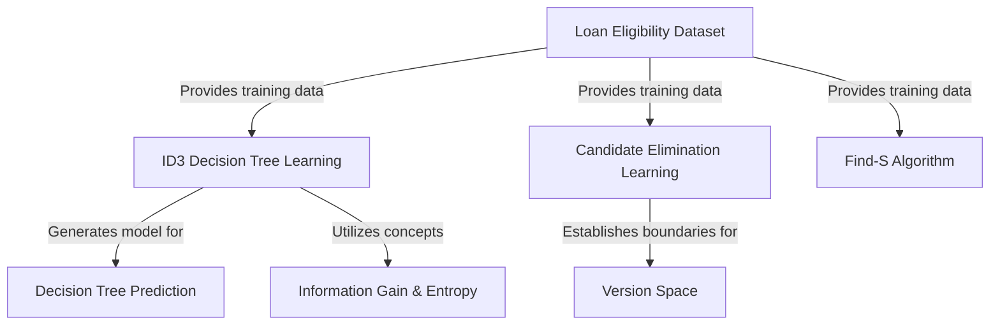

# Tutorial: Loan-eligibility-ML

This project explores different machine learning techniques to predict whether a *loan application* will be approved based on historical data. It demonstrates how to train a **Decision Tree model** to make eligibility predictions, and also uses algorithms like **Candidate Elimination** and **Find-S** to learn specific or general rules from the examples provided in the *loan eligibility dataset*.

## Visual Overview

## Chapters

1. [Loan Eligibility Dataset
](01_loan_eligibility_dataset_.md)
2. [Decision Tree Prediction
](02_decision_tree_prediction_.md)
3. [ID3 Decision Tree Learning
](03_id3_decision_tree_learning_.md)
4. [Information Gain & Entropy
](04_information_gain___entropy_.md)
5. [Find-S Algorithm
](05_find_s_algorithm_.md)
6. [Candidate Elimination Learning
](06_candidate_elimination_learning_.md)
7. [Version Space
](07_version_space_.md)

---
